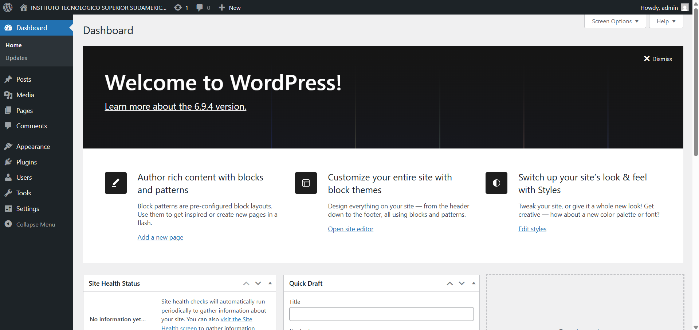
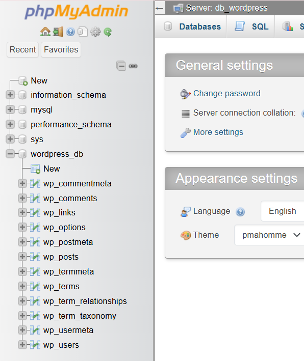

# Informe de Práctica: Servidor Web con Microservicios en Docker

## 1. Título
**Implementación de un CMS WordPress mediante Arquitectura de Microservicios con Docker: Orquestación de Redes, Volúmenes y Contenedores.**


## 2. Tiempo de duración
**120 minutos.**


## 3. Fundamentos

Docker es una plataforma de código abierto que automatiza el despliegue de aplicaciones dentro de contenedores de software. Un contenedor es una unidad estándar de software que empaqueta el código y todas sus dependencias para que la aplicación se ejecute de forma rápida y confiable de un entorno informático a otro. A diferencia de las máquinas virtuales, los contenedores no incluyen un sistema operativo completo, sino que comparten el kernel del host, lo que los hace extremadamente ligeros y eficientes.

Para esta práctica, se han utilizado tres pilares fundamentales de Docker:

### Imágenes
Plantillas de solo lectura que contienen las instrucciones para crear un contenedor. En este caso, utilizamos imágenes oficiales de MySQL, WordPress y phpMyAdmin.

### Redes (Docker Networks)
Por defecto, los contenedores están aislados. La creación de una red tipo bridge personalizada permite que los contenedores se descubran entre sí mediante el nombre del contenedor (DNS interno), facilitando la comunicación entre el servidor web y la base de datos sin exponer puertos sensibles al exterior.

### Volúmenes (Docker Volumes)
Son el mecanismo preferido para persistir los datos generados y utilizados por los contenedores. Sin volúmenes, cualquier cambio en la base de datos o archivos subidos a WordPress se perdería al eliminar el contenedor. Los volúmenes desacoplan el ciclo de vida del dato del ciclo de vida del contenedor.

La arquitectura implementada sigue el patrón de microservicios: un contenedor se encarga exclusivamente del motor de base de datos (MySQL), otro del procesamiento de PHP y servidor web (WordPress) y un tercero de la interfaz de administración (phpMyAdmin). Esta separación permite escalar o actualizar cada componente de forma independiente, mejorando la mantenibilidad y seguridad del sistema global.

---

## 4. Conocimientos previos

Para realizar esta práctica con éxito, el estudiante debe dominar los siguientes temas:

- Comandos Linux: Navegación por terminal (cd, ls), gestión de permisos y sintaxis básica.
- Fundamentos de Docker: Diferencia entre imagen, contenedor, volumen y red.
- Redes TCP/IP: Conceptos de puertos (80, 8080, 3306) y direccionamiento IP.
- Manejo de Navegador: Uso de herramientas de desarrollador y gestión de puertos en entornos cloud.
- Conceptos de Bases de Datos: Usuario root, nombres de esquemas y persistencia de datos.


## 5. Objetivos a alcanzar

- Implementar una red virtual privada en Docker para la interconexión segura de servicios.
- Configurar volúmenes persistentes para asegurar la integridad de la información en MySQL y WordPress.
- Desplegar un servidor de base de datos MySQL 8.0 parametrizado mediante variables de entorno.
- Integrar phpMyAdmin como herramienta de gestión gráfica de base de datos.
- Finalizar la instalación de un CMS WordPress funcional conectado a la infraestructura creada.


## 6. Equipo necesario

- Computador con conexión a Internet estable.
- Sistema Operativo: Windows 10/11, Linux o macOS.
- Navegador web (Chrome, Firefox o Edge).
- Entorno de ejecución: Killercoda Playground (Ubuntu 22.04 con Docker preinstalado).
- Docker Versión: 20.10.x o superior.


## 7. Material de apoyo

- Documentación oficial de Docker.
- Docker Hub (Repositorios oficiales de MySQL y WordPress).
- Cheat Sheet de comandos básicos de Linux y Docker.


## 8. Procedimiento

### Paso 1: Preparación del entorno de red
Se crea una red aislada para permitir la comunicación por nombre entre contenedores.

```bash
docker network create wordpress_net
```

### Paso 2: Creación de volúmenes de persistencia
Se definen los espacios de almacenamiento para que los datos sobrevivan al reinicio de los contenedores.

```bash
docker volume create mysql_data
docker volume create wordpress_data
```

### Paso 3: Despliegue del motor de base de datos MySQL
Se lanza el contenedor configurando las credenciales de administrador y la base de datos inicial.

```bash
docker run -d --name db_wordpress \
  --network wordpress_net \
  -v mysql_data:/var/lib/mysql \
  -e MYSQL_ROOT_PASSWORD=admin123 \
  -e MYSQL_DATABASE=wordpress_db \
  mysql:8.0
```

### Paso 4: Implementación de la interfaz de administración de BD
Se despliega phpMyAdmin vinculado a la base de datos anterior.

```bash
docker run -d --name pma_wordpress \
  --network wordpress_net \
  -e PMA_HOST=db_wordpress \
  -p 8080:80 \
  phpmyadmin:latest
```

### Paso 5: Despliegue del servidor WordPress
Se lanza el CMS conectándolo a la base de datos mediante variables de entorno específicas.

```bash
docker run -d --name site_wordpress \
  --network wordpress_net \
  -v wordpress_data:/var/www/html \
  -e WORDPRESS_DB_HOST=db_wordpress \
  -e WORDPRESS_DB_USER=root \
  -e WORDPRESS_DB_PASSWORD=admin123 \
  -e WORDPRESS_DB_NAME=wordpress_db \
  -p 80:80 \
  wordpress:latest
```


## 9. Resultados esperados

**Dashboard de WordPress** y las tablas de sistema en **phpMyAdmin**.

### Captura del resultado final (Escritorio de WordPress)



### Captura de la base de datos (phpMyAdmin)



## 10. Bibliografía

- Docker. (2024). *Docker Documentation*. Recuperado de: https://docs.docker.com/

- MySQL. (2024). *MySQL 8.0 Reference Manual*. Oracle Corporation. Recuperado de: https://dev.mysql.com/doc/refman/8.0/en/

- WordPress Foundation. (2024). *WordPress Codex: Installing WordPress*. Recuperado de: https://wordpress.org/support/article/how-to-install-wordpress/

- Killercoda. (2024). *Interactive Learning Scenarios for Docker*. Recuperado de: https://killercoda.com/
